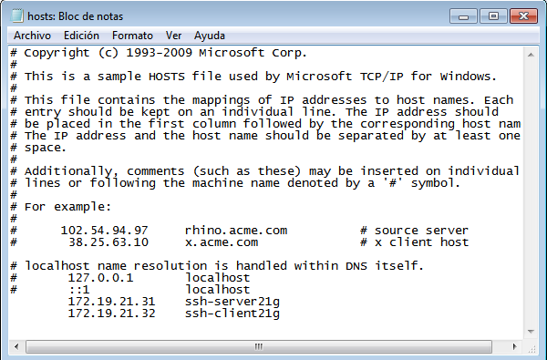
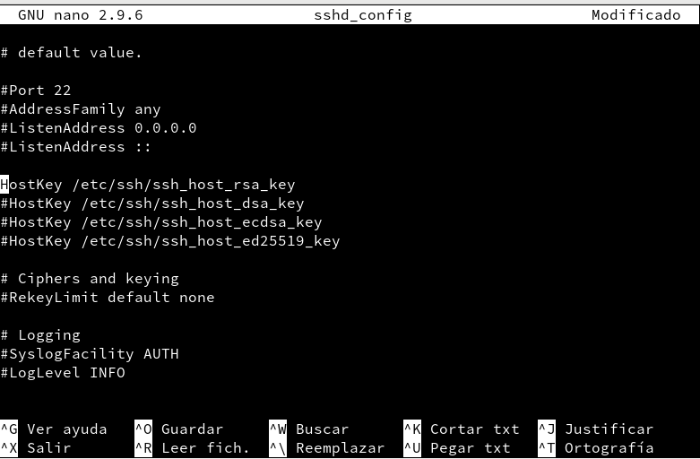

# A1 Acceso Remoto SSH
## Preparativos
Vamos a la máquina `ssh-server21g` y añadimos a **/etc/hosts** los equipos `ssh-client21g` y `ssh-client21w`.

Ahora comprobamos que hay conexión entre ambos equipos.

Vamos a la máquina `ssh-client21g` y añadimos a **/etc/hosts** los equipos `ssh-server21g` y `ssh-client21w`.

Ahora comprobamos que hay conexión entre ambos equipos.

Vamos a la máquina `ssh-client21w` e instalamos el software cliente SSH, usaremos *PuTTY*.
Ahora añadiremos a **C:\Windows\System32\drivers\etc\hosts** los equipos `ssh-server21g` y `ssh-client21g`.

Ahora comprobamos que hay conexión entre ambos equipos.

##  Primera conexión SSH GNU/Linux
Vamos al cliente `ssh-client21g` que hemos creado y hacemos un ping a `ssh-server21g` para comprobar la conectividad con el servidor.

Ahora vamos a la máquina real y comprobamos si los puertos están abiertos en el servidor.

Vamos a ir a la maquina Cliente y nos conectamos mediante ssh al servidor Linux.

Ahora si nos volvemos a conectar nos sale:

A continuación vamos a comprobar el contenido de **/.ssh/know_hosts** en el equipo `ssh-client21g`.

## Primera conexión SSH desde cliente Windows
Entramos en el cliente Windows y nos conectamos por SSH usando PuTTY.

## Cambiamos la identidad del servidor y comprobamos
Vamos a entrar en **/etc/ssh** y comprobamos si están los ficheros `ssh_host*key` y `ssh_host*key.pub`.

Ahora modificaremos el fichero de configuración **(IMPORTANTE: entrar como root para modificarlo)** `/etc/ssh/sshd_config `para dejar una única linea: `HostKey /etc/ssh/ssh_host_rsa_key` (Quitar # de la linea).

Ahora entramos como usuario root y ejecutamos `ssh-keygen -t rsa -f /etc/ssh/ssh_host_rsa_key`y no poner contraseña al certificado de la máquina. A continuación reiniciamos el servicio SSH y comprobamos que se está ejecutando correctamente.

Ahora comprobamos que sucede al volver a conectarnos desde los clientes `hernandez1` y `hernandez2`.

Para solucionarlo ejecutamos el comando `ssh-keygen -R ssh-server21g -f /home/guillermo/.ssh/know_hosts`.

Por último veremos que nos deja de nuevo acceder a los clientes.

## Autenticación mediante claves públicas
Vamos a la máquina **ssh-client21g** e iniciamos seción con nuestro usuario **guillermo**. Luego generamos un par de claves con el comando **ssh-keygen -t rsa** en los directorios `/home/guillermo/.ssh/id_rsa` y `/home/guillermo/.ssh/id_rsa.pub`.

Ahora vamos a copiar la clave pública `id_rsa.pub` al fichero `autorized_keys` del usuario remoto **hernandez4**. Utilizaremos el comando `ssh-copy-id hernandez4@ssh-server21g`.

Por último comprobamos si nos deja acceder remotamente vía SSH. Desde **ssh-client21g** no se pide password, en cambio desde **ssh-client21w** sí se pide.

## Uso de SSH como túnel para X
Vamos a instalar en el servidor una Aplicación de entrono gráfico que no esté en los clientes. Vamos a elegir la Aplicación **Geany**.

Ahora modificamos el fichero `/etc/ssh/sshd_config` para permitir la ejecución de aplicaciones gráficas. La opción `X11Forwarding yes` .

Entramos en la máquina **cliente21g** y comprobamos si Geany está instalado `zypper se geany`.

Ahora comprobamos desde el cliente que funciona el Geany del servidor. Utilizaremos el comando `ssh -X hernandez1@ssh-server21g`.

## Restricciones de uso
### Restricción sobre un usuario
En el servidor tenemos el usuario **hernandez2**. Vamos a modificar el SSH de modo que al usar ese usuario desde los clientes tendremos permiso denegado. Entramos en el fichero `/etc/ssh/sshd_config` para restringir el acceso a determinados usuarios. Pondremos `DenyUsers hernandez2`

Ahora comprobaremos la restricción al acceder desde los clientes. Como veremos no nos deja poner la contraseña.

### Restricción sobre una aplicación
Creamos el grupo `remoteapps` e incluimos al usuario **hernandez4** a este grupo.

Localizamos el programa Geany y miramos que permisos tiene.

Ahora cambiaremos el programa al grupo `remoteapps`

Podremos los permisos del ejecutable a 750.

Ahora comprobamos el funcionamiento en el servidor en local y desde el cliente en remoto.

