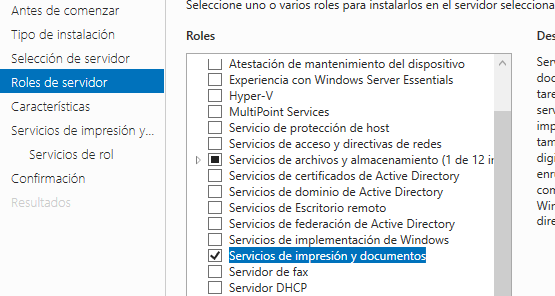
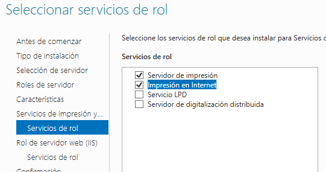
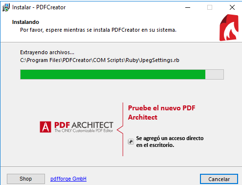
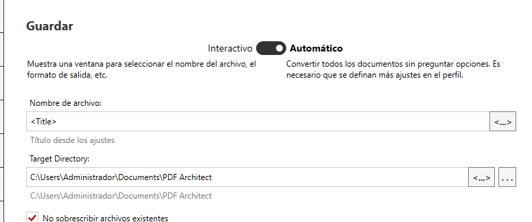

# Servidor de impresión en Windows
## Impresora Compartida
### Rol de impresión
Vamos al servidor e instalaremos el rol de servidor de impresión (incluir impresión por internet).

### Instalar impresora PDF
Descargaremos e instalaremos PDFCreator y lo configuramos en `Perfiles -> Guardar -> Automático`.

### Probar la impresora en local
Vamos a probar la impresora. Abrimos un bloc de notas, creamos un fichero y luego seleccionamos Imprimir. Se abrirá un archivo PDF con el resultado de la impresión.
