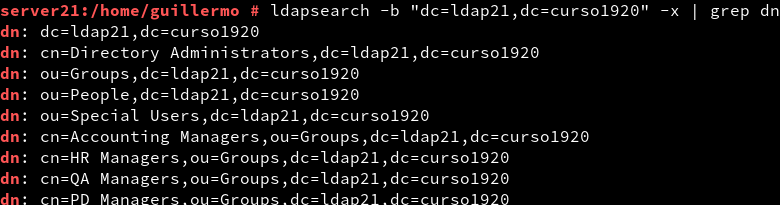
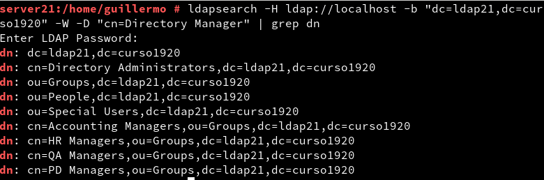
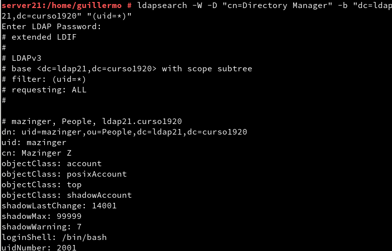
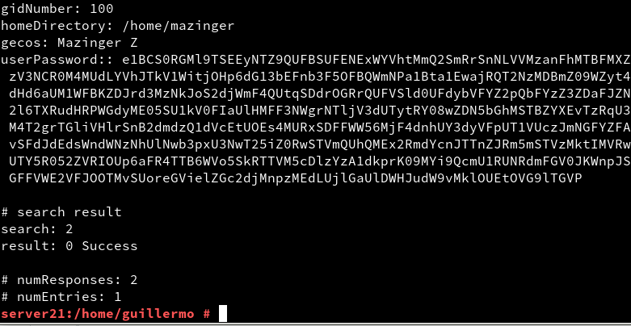
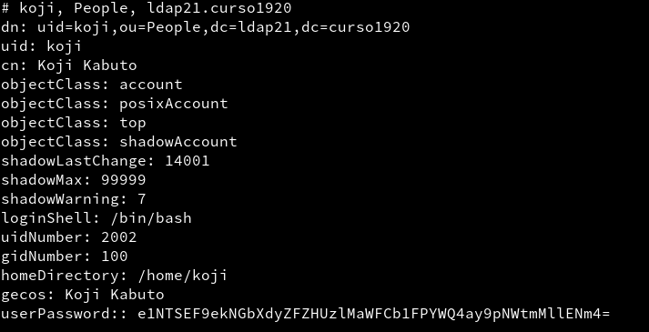
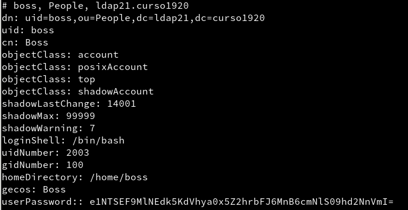
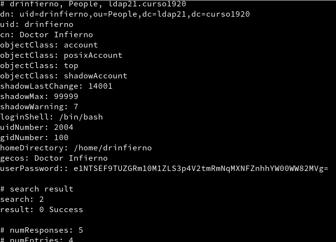

# Servidor 389-DS - Opensuse

## [2.3] Comprobamos el acceso al contenido del LDAP
Utilizaremos el comando **ldapsearch -b "dc=ldap21,dc=curso1920" -x | grep dn** para mostrar el contenido de nuestra base de datos.

Ahora usaremos el comando **ldapsearch -H ldap://localhost -b "dc=ldap21,dc=curso1920" -W -D "cn=Directory Manager" | grep dn** para hacer la consulta usando usuario/clave.

## [3.3] Comprobar el nuevo usuario

Después de crear el usuario *Mazinger*, usamos el comando **ldapsearch -W -D "cn=Directory Manager" -b "dc=ldap21,dc=curso1920" "(uid=*)"** para comprobar si se ha creado el usuario.

 ## [4.3]Comprobar los usuarios creados

Después de crear los usuarios *Koji*, *boss* y *drinfierno*, ejecutamos el comando anterior para hacer la comprobación.

