# Vagrant con Virtualbox
## 3.3: Comprobar proyecto 1
__vagrant up__ para iniciar una nueva instancia de la máquina.

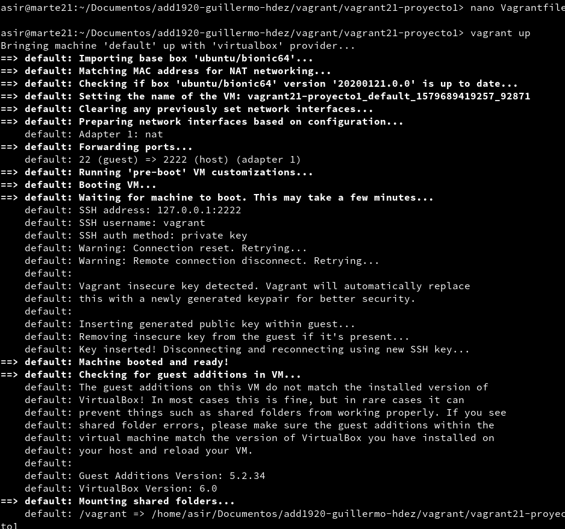

__vagrant ssh__ para entrar en nuestra máquina virtual usando SSH.

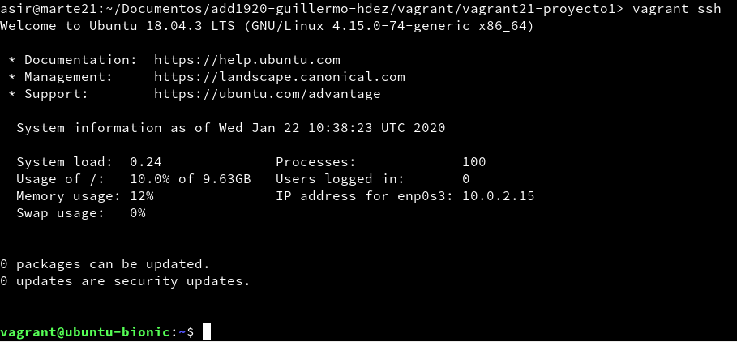

## 5.2: Comprobar proyecto 2
Comprobamos que el puerto 4567 está a la escucha. __vagrant port__ para ver la redirección de puertos de la máquina Vagrant.

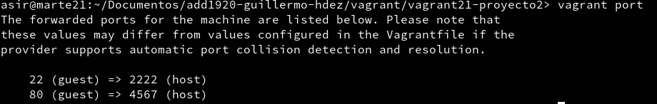

Abrimos el navegador web con el URL __http://127.0.0.1:4567__.

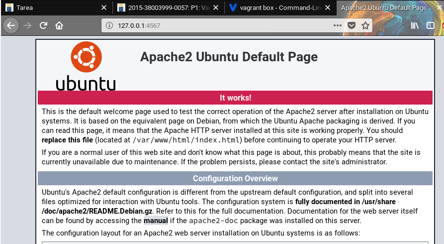

## 6.1: Proyecto 3 (Suministro Shell Script)

Creamos el directorio __vagrant21-proyecto3__ y dentro un proyecto Vagrant.

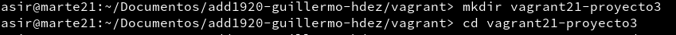
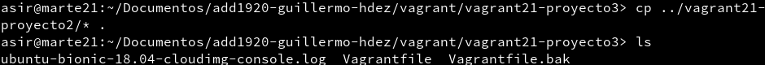

Creamos un script que se llame __insatll_apache.sh__.

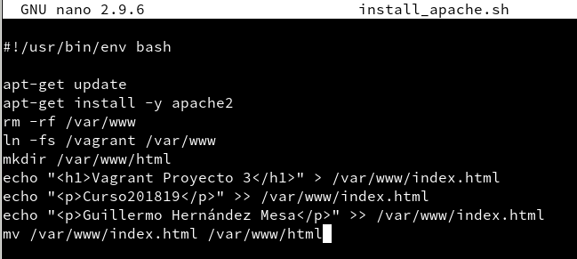

Ahora modificamos el fichero __Vagrantfile__ y agregamos la línea a la configuración.

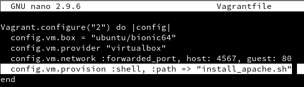

Hacemos __vagrant reload__ para recargar la MV y verificamos que el servidor apache se ha instalado e iniciado correctamente.

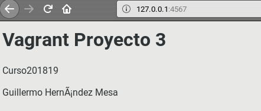

## 6.2: Proyecto 4 (Suministro mediante Puppet)

Creamos el directorio __vagrant21-proyecto4__ y dentro un proyecto Vagrant.

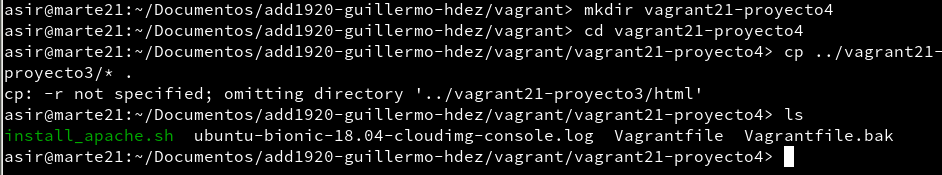

Modificamos el archivo __Vagrantfile__.

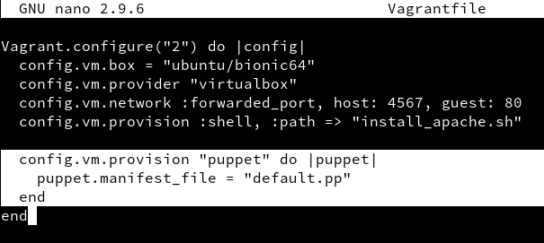

Ahora hay que crear el fichero __manifests/default.pp__, con las órdenes/instrucciones puppet para instalar el programa __nmap__.

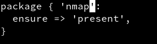

Entramos por ssh a la MV e instalamos el __puppet__.

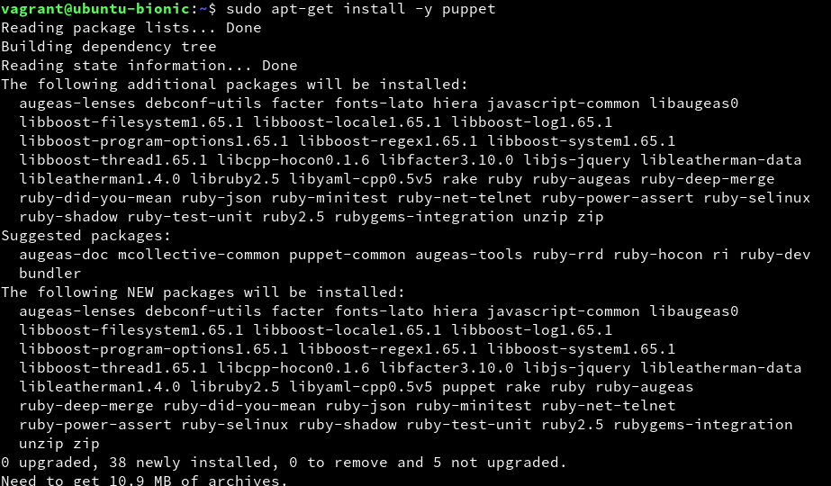

Ahora vamos a aplicar los cambios. Recargamos la configuraciónde la MV y volvemos a ejecutar la provisión.

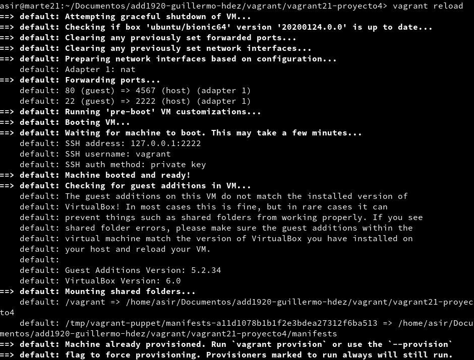
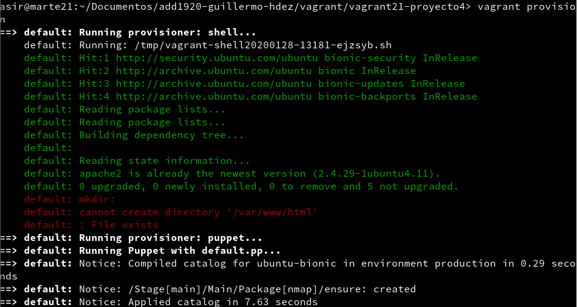

Por último, comoprobamos que se instaló el __nmap__.

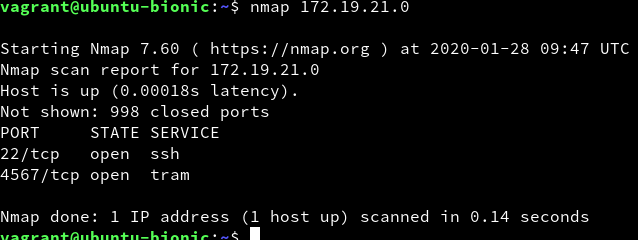
