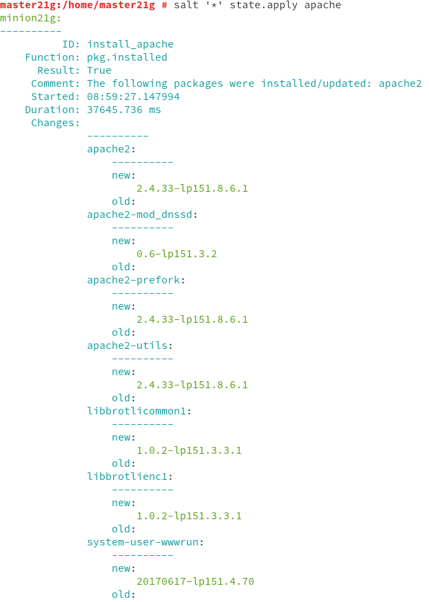

# Salt-stack
## Preparativos
Vamos a crear 2 MVs OpenSUSE. La primera se llamará __master21g__ y tendrá la IP __172.19.21.31__; y la segunda se llamará __minion21g__ y tendrá la IP __172.19.21.32__.

## Master: Instalar y configurar
Instalamos el software del master con el comando `zypper install salt-master` y modificamos el fichero `/etc/salt/master` para configurar nuestro Master.

Activaremos el servicio en el arranque del sistema, iniciamos el servicio y consultamos los minions aceptados, veremos que no hay ninguno. (en mi caso si hay uno, pero no hay que hacerle caso)

## Minion
### Instalación y configuración
Instalamos el software del agente con `zypper install salt-minion` y modificamos el fichero `/etc/salt/minion` para definir quien será nuestro master.

Ahora activamos el Minion en el arranque del sistema, iniciamos el servicio y comprobamos que no tiene __apache2__ instalado.

### Aceptación desde el Master
Vamos a la MV1 y nos aseguramos de que el cortafuegos permite las conexiones al servicio Salt.

Ahora vemos que el Master recibe petición del Minion.

Vamos a hacer que el Master acepte a dicho Minion y comprobamos.

### Comprobamos conectividad
Vamos a comprobar la conectividad desde el Master a los Minions.

## Salt States
### Preparar el directorio para los estados
En la MV Master, creamos los directorios `/srv/salt/base` y `/srv/salt/devel`.

Ahora creamos un fichero `/etc/salt/master.d/roots.conf` con el siguiente contenido:

Reiniciamos el servicio del Master.

### Crear un nuevo estado
Creamos el fichero `/srv/salt/base/apache/init.sls` con el siguiente contenido:

### Asociar Minions a estados
Crear `/srv/salt/base/top.sls` donde asociamos a todos los minions con el estado que acabamos de definir.

### Comprobar estados definidos
Ejecutamos el siguiente comando para consultar los estados que tenemos definidos.

### Aplicar el nuevo estado
Consultamos los estados en detalle para verificar que no hay errores.

Ahora aplicamos el nuevo estado en todos los minions.

## Crear más estados
### Crear estado "users"
Creamos un estado llamado __users__ que nos sirve para crear un grupo y usuarios en las máquinas minios.

Creamos el directorio `/srv/salt/base/users` y dentro el fichero `init.sls` con las definiciones para crear el grupo __mazingerz__ y los usuarios __koji21__ y __drinfierno21__ dentro del grupo.

Ahora aplicamos el estado.

Vamos a la MV Minion y comprobamos.

### Crear estado "directories"
Creamos el estado llamado __directories__ para crear las carpetas `private`(700), `public`(755) y `group`(750) en el home del usuario __koji21__.

Ahora aplicamos el estado.

## Añadir Minion de otro SO
Crearemos una MV3 con SO Windows que se llame __minion21w__

Nos descargamos el `Salt-minion` y lo instalamos.

Vamos al __CMD__ y activamos el servicio.

Ahora vamos a la MV Master y comprobamos las peticiones pendientes.

Lo agregamos al master y volvemos a comprobar.

