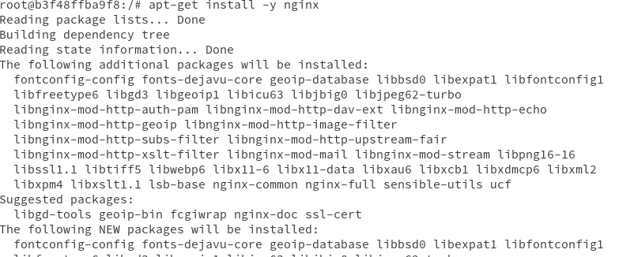

# Docker
## Instalación y primeras pruebas
### Habilitar el acceso a la red externa a los contenedores
Miramos el archivo `/proc/sys/net/ipv4/ip_forward` para consltar el estado de __IP_FORWARD__.

Para activarlo, vamos a _Yast -> Ajustes de red -> Encaminamiento_ y seleccionamos __Habilitar reenvío de ipv4__.

Guardamos, reiniciamos y comprobamos que se cambió la configuración.

### Instalación
Instalaremos docker.

Ahora iniciamos el servicio y comprobamos la versión.

### Primera Prueba
Insertamos el usuario al grupo __docker__.

Ahora mostramos las imágenes descargadas hasta ahora.

Ahora vamos a mostrar los contenedores creados, que por el momento no hay ninguno.

Descargamos una imagen __hello-world__, creamos un contenedor y ejecutamos la aplicación que hay dentro.

Comprobamos que está la imagen.

Vemos que hay un contenedor en Estado __Exited__.

Ahora paramos el contenedor, lo eliminamos y comprobamos.

## Creación manual de nuestra imagen
### Crear un contenedor manualmente
Descargamos una imagen debian, para ello buscamos en los repositorios de __Docker Hub__, descargamos la imagen en local y comprobamos.

Creamos un contenedor con el nombre __con_debian__ a partir de la imagen que descargamos anteriormente y ejecutamos el programa `/bin/bash` dentro del contenedor.

### Personalizar el contenedor
Instalamos aplicaciones dentro del contenedor, como por ejemplo __Nginx__ y __vi__.

Crearemos un fichero HTML que se llame `holamundo.html`.

Creamos un script que se llame __/root/server.sh__

 Le ponemos permisos de ejecución.

 

### Creamos una imagen a partir del contenedor
A partir del contenedor creado, crearemos una nueva imagen que se llamará __guillermo/nginx1__ y comprobamos.

## Crear contenedor a partir de nuestra imagen
### Crear contenedor con Nginx
Iniciamos el contenedor a partir de la imagen anterior.

### Comprobamos
Abrimos una nueva terminal y hacemos `docker ps` para ver en que puerto se está ejecutando.

Abrimos un navegador y comprobamos que entra en el puerto y en __holamundo.html__.

Paramos el contenedor y lo eliminamos.

### Migrar la imagen a otra máquina
Exportamos la imagen docker a fichero tar.

Importaremos la imagen de un compañero de clase y la cargamos.

Crearemos un contenedor a partir de la nueva imagen.

Comprobamos por el navegador si funciona.

## Dockerfile
### Preparar ficheros
Creamos el directorio __/home/guillermo/docker21a__ y dentro copiamos los ficheros __holamundo.html__ y __server.sh__.

Creamos el fichero `Dockerfile`,.

### Crear imagen a partir del Dockerfile

Entramos en el directorio, construimos la imagen y comprobamos que se ha creado.

### Crear contenedor y comprobar
vamos a crear un contenedor con el nombre `app4nginx2` a partir de la imagen anteriormente creada.

Abrimos otro terminal y averiguamos el puerto de escucha del servidor Nginx.

 

 Comprobamos en el navegador.

 
 

### Usar imágenes ya creadas

Creamos el directorio __docker21b__  dentro creamos el Dockerfile.

Creamos la imagen y creamos el contenedor.

## Limpiar contenedores e imágenes
Cuando terminamos con los contenedores, los vamos a parar y destruir.

